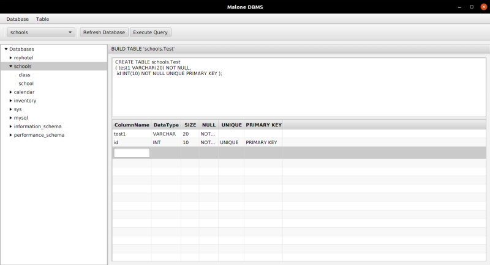

# MySQL Administrator
This is a graphical user interface(GUI) administration tool for MySQL database. It is written in Java, using JavaFx and JavaSE Swing.


## Table of Contents
* [Technologies Used](#technologies-used)
* [Features](#features)
* [Setup](#setup)
* [Project Status](#project-status)
* [Room for Improvement](#room-for-improvement)
* [Contact](#contact)


## Technologies Used
- __Java__ - version 17
- __JavaFX__ - version 11
- __MySQL Connector__ - version 8.3.0


## Features
### Implemented
1. Create, Read and Delete Database.

2. View Table Schema Meta data.


3. Create, Read, Insert, Update and Delete Table.



4. Execute SQL Query.


## Setup
- Find `src/main/resources/application.properties` file. You will find the following keys:

```java
connection.url=jdbc:mysql://localhost:3306
connection.username=admin
connection.password=admin
```
- Populate the keys with correct value.
- You can run the project using `Maven` or `Ant`

### A. Maven
- The project is configured with `maven wrapper`, you do not need to install maven to compile it.

- Open the Command Line Interface and change directoryto the root of the project. To compile the project run the following command:
```bash
./mvnw clean install
```

- To execute the compiled classes use the following command line: 
```bash
./mvnw exec:java
```


### B. ANT
1. Install `Apache Ant` (https://ant.apache.org/), a command line tool used to build Java applicaton. 

2. At the root of the project create `lib` folder. 

3. Download the following dependacies and copy them in the `lib` folder: 
	- mysql-connector-j-8.3.0 (https://dev.mysql.com/downloads/connector/j/)
	- javafx-sdk-21.0.2 (https://gluonhq.com/products/javafx/)

4. The project consists of a `Java Swing` and `JavaFX` application.
	
	- To build and run the java swing application:
	```bash
	ant main
	```

	-  To build and run the java fx application:
	```bash
	ant main-javafx
	```


## Project Status
Project is: _in progress_ 


## Room for Improvement
Room for improvement:
- 
- 

To do:
- Login to DBMS
- Configure Database Ports
- Create, Read and Delete Users
- Create, Read and Delete Role


## Contact
Created by [@ElkanahMalonza](https://elkanahmalonza.netlify.app/) - feel free to contact me!

